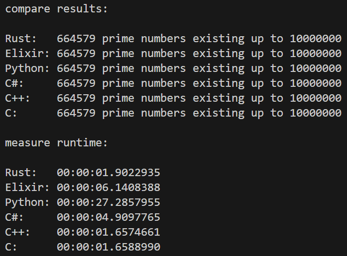

# Multilingual Prime Counter

## Abstract
The goal of this project is to get a little insight into different programming languages.
Therefore a small challenge was defined to be implemented in different programming languages.

## Challenge
The simple challenge is to count the existing prime numbers in a certain number range.  
A console program takes the maximum number as an argument and prints how many prime numbers are existing up to this number.

## Languages
- Elixir
- Python
- C#

## Comparison
A powershell script compares the runtime of the programs.

### Example output
This is an example output of the comparison script.  
Executed on an AMD Ryzen 5 2600.

